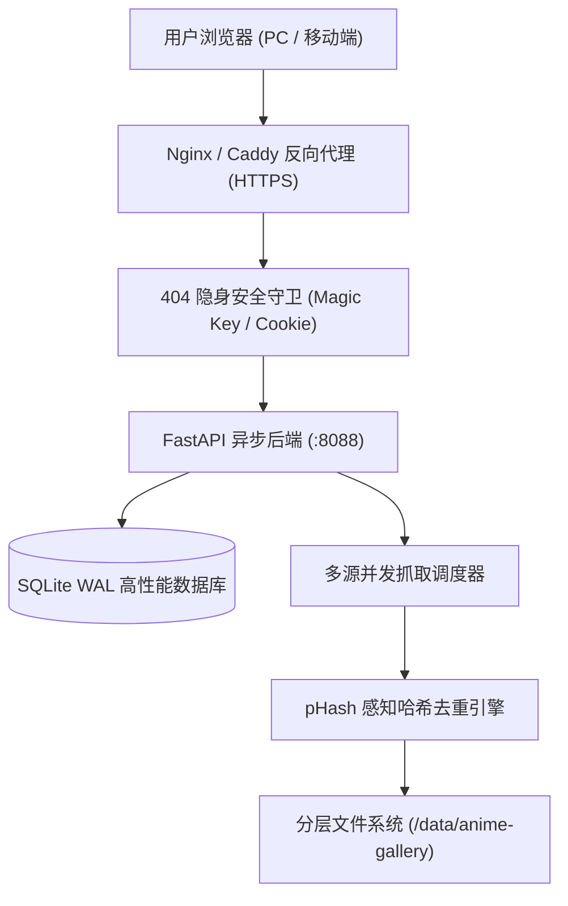

# 🌌 Aurora Curator (二次元动漫原画智能聚合画廊系统)

<p align="center">
  
  
  
  
  
  
</p>

> **Aurora Curator** 是一款现代化、极简高质感、高并发的二次元动漫插画智能检索、感知哈希去重、批次隔离管理与私有化永久收藏系统。专为二次元原画爱好者打造，支持一键并发检索角色、按热度排序、纯净分级隔离、全屏灯箱滑动手势、404 隐身防护与私有设备授权。

---

## ✨ 核心特性

### 🔍 1. 多源并发检索聚合 (Multi-Source Crawling Engine)
- **多语言角色智能解析**：支持中文、日文平假名/片假名、英文名、拼音智能对照（如：`初音未来` / `初音ミク` / `Hatsune Miku`）。
- **聚合检索源**：集成 Danbooru、Safebooru、Yande.re、Zerochan、Pixiv 等主流数据源，按点赞量与热度降序抓取高清原图。
- **纯净分级互斥隔离**：支持 `🍀 全年龄 (SFW)` 与 `🔞 R-18 限制级` 严格分流隔离，杜绝内容混淆。

### 🧬 2. 多重感知哈希毫秒去重 (Perceptual Hashing)
- 采用 **pHash (感知哈希) + aHash (均值哈希) + dHash (差异哈希)** 混合算法。
- 自动计算汉明距离（Hamming Distance ≤ 5 判定为重复），毫秒级自动过滤同图多发、裁切微调或不同分辨率重图。

### 🏷️ 3. 物理隔离批次流水线 (Batch Demarcation & Isolation)
- **楚河汉界，物理隔离**：每次抓取作为独立批次容器渲染，上一批在上面，下一批在下面，互不影响。
- **发光极光胶囊分界线**：贯穿左右的极细微光分割线，居中浮动玻璃态胶囊徽章，标注批次编号、分级属性、新图数量与抓取时间戳。
- **悬浮控制台 (FAB Dock)**：右下角胶囊控制坞，支持快速抓取下一批、参数弹窗配置、直达最新批次与平滑回顶。

### 🛡️ 4. 404 隐身防护与专属安全授权 (Stealth Cloaking)
- **404 隐身模式**：未授权访问直接返回真实 404 Not Found，对外完全隐形。
- **Magic Key 设备激活**：携带专属密钥 `?key=<TOKEN>` 访问后自动颁发 10 年长效设备 Token，下次免密秒开。
- **一键全网公开切换**：随时在设置中一键开放全网公开访问或恢复独占私有保护。

### 📱 5. 全终端多模态排版与手势适配 (Multi-Device Experience)
- **三模态排版切换**：
  - 📱 **单列大图流**：超大画幅沉浸式单幅浏览，细节一览无遗。
  - 🖼️ **双列精选流**：手机/平板紧凑双列并排，效率与视觉平衡。
  - 🧱 **瀑布流网格**：自适应 Masonry 布局，高度利用屏幕空间。
- **触控滑动手势**：全屏大图灯箱（Lightbox）原生支持手机左右滑动手势切图。
- **iOS 安全区原生适配**：底栏与悬浮窗完美避让全面屏 Home 条。

---

## 🏗️ 系统架构



### 📂 存储分层规范

```
/data/anime-gallery/
├── temp/        # 临时待选区（按角色归档，一键清理不心疼）
├── favorites/   # 永久收藏区（【绝对保护资产】，清理机制永不触碰）
├── cache/       # WebP 极速缩略图缓存（Pillow 针对性压缩）
└── db/          # SQLite 数据库与持久化配置
```

---

## 🚀 快速上手

### 选项 A：Docker Compose 一键部署（推荐）

1. **克隆代码库**：
   ```bash
   git clone https://github.com/<YOUR_USERNAME>/aurora-curator.git
   cd aurora-curator
   ```

2. **配置环境变量**：
   ```bash
   cp .env.example .env
   # 按需编辑 .env 配置存储路径与端口
   ```

3. **构建并启动容器**：
   ```bash
   docker compose up -d --build
   ```

4. **访问服务**：
   打开浏览器访问：`http://localhost:8088/`

---

### 选项 B：原生 Python 环境运行

1. **准备 Python 3.11+ 环境**：
   ```bash
   python3 -m venv venv
   source venv/bin/activate
   pip install -r requirements.txt
   ```

2. **启动服务**：
   ```bash
   python main.py
   ```
   服务将监听 `0.0.0.0:8088`。

---

## ⚙️ 环境变量说明 (`.env`)

| 环境变量 | 默认值 | 描述 |
| :--- | :--- | :--- |
| `SERVER_HOST` | `0.0.0.0` | 后端服务监听地址 |
| `SERVER_PORT` | `8088` | 后端服务端口 |
| `ANIME_DATA_DIR` | `/data/anime-gallery` | 本地数据存储与数据库挂载目录 |
| `DEFAULT_SEARCH_LIMIT` | `100` | 默认单词抓取数量 |
| `MAX_SEARCH_LIMIT` | `300` | 单次最大允许抓取上限 |

---

## ⌨️ 快捷键支持 (Lightbox 大图模式)

| 按键 | 功能 |
| :---: | :--- |
| `←` 或 `A` | 切换上一张插画 |
| `→` 或 `D` | 切换下一张插画 |
| `S` | 一键收藏 / 取消收藏 |
| `Delete` / `Backspace` | 删除当前图片 |
| `Esc` | 退出大图全屏模式 |
| 📱 手机左滑 / 右滑 | 切换上一张 / 下一张 |

---

## 📄 开源许可证

本项目基于 [MIT License](LICENSE) 开源发布。
